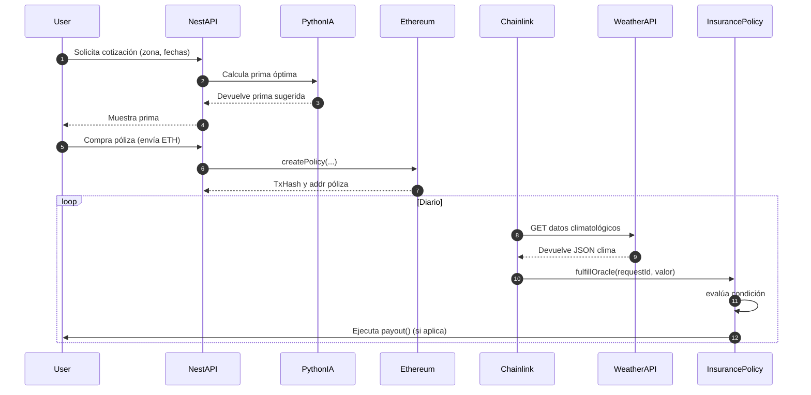
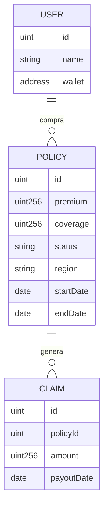

# Resumen Ejecutivo

Se propone un sistema de **micro-seguros climáticos paramétricos** utilizando blockchain. El contrato inteligente ejecuta pagos automáticos al verificarse un evento climático predefinido (por ejemplo, X días sin lluvia). Se integrarán **oráculos Chainlink** para obtener datos meteorológicos en tiempo real y un modelo de machine learning (por ejemplo, Prophet o LSTM) para calcular la prima óptima. El proyecto abarca el diseño de la arquitectura on-chain/off-chain, contratos Solidity detallados, pipelines de IA en Python, backend NestJS para la lógica de negocio y despliegue en red de prueba. El resultado será un sistema robusto, extensible y totalmente gratuito en herramientas (OpenZeppelin, Hardhat, librerías Python/Node open-source).

## 1. Objetivos

- **Contratos inteligentes:** Crear contratos Solidity que gestionen pólizas parametrizadas por clima, reciban primas en ETH y ejecuten pagos automáticos.
- **Tarificación asistida por IA:** Implementar un módulo de ML que estime la prima según historial climático de la región.
- **Integración de oráculos:** Usar Chainlink para conectar los contratos con datos de clima externos de forma segura.
- **Backend administrable:** Desarrollar un API en NestJS (Node.js v18+) que maneje la lógica de negocio, llame a los contratos y al modelo de IA.
- **Infraestructura reproducible:** Entorno local de desarrollo (Hardhat), contenedores Docker y CI/CD (GitHub Actions) que permitan rápido despliegue en testnet.

## 2. Requisitos Funcionales

- **Creación y gestión de pólizas:** Los usuarios deben poder solicitar cotizaciones (con parámetros de zona, fecha y umbral climático), recibir la prima calculada y adquirir la póliza (enviando ETH).
- **Monitoreo climático:** El contrato debe verificar diariamente el parámetro climático usando oráculos.
- **Liquidación automática:** Si se cumple la condición (p.ej. lluvia > umbral), el contrato debe ejecutar el pago al asegurado.
- **Consultas y reportes:** API para consultar el estado de pólizas (activa, pagada o vencida).
- **Administración:** Endpoints protegidos para iniciar el modelo de IA, gestionar claves y revisar logs.

## 3. Requisitos No Funcionales

- **Seguridad:** Uso de librerías auditadas (OpenZeppelin) y buenas prácticas (manejo seguro de llaves, validaciones).
- **Escalabilidad:** Arquitectura modular para soportar múltiples pólizas y regiones simultáneamente.
- **Disponibilidad:** Despliegue en contenedores Docker para facilitar portabilidad y escalado.
- **Calidad:** Pruebas automatizadas exhaustivas (contratos, backend y ML) y linters configurados.
- **Documentación:** Incluir un README detallado con instrucciones de instalación, uso y despliegue.

## 4. Casos de Uso

- **Agricultores:** Contratan cobertura paramétrica por sequía o granizo. Ej. Si en temporada agrícola pasan N días sin lluvia, reciben el pago.
- **Organizadores de Eventos:** Aseguran eventos al aire libre contra lluvia. Si el evento coincide con precipitaciones intensas, reciben indemnización.
- **Viajeros y Carga:** Cobertura contra condiciones climáticas extremas en viaje. Si se detectan tormentas fuertes en ruta, se activa la póliza.

## 5. Arquitectura Técnica (Mermaid)

```mermaid
graph LR
  subgraph Ethereum On-Chain
    A[InsuranceProvider.sol] --> B[InsurancePolicy.sol]
    B -->|requestWeatherData()| C(Chainlink Node)
    C -->|fulfill(data)| B
    B -->|payout()| Insured
  end
  subgraph Backend Off-Chain
    D[NestJS API] -->|RPC| A
    D --> E[Python IA Service]
    E --> D
  end
```

_Esquema de arquitectura:_ Contrato factory `InsuranceProvider` despliega instancias `InsurancePolicy`. Estas últimas llaman al nodo Chainlink para obtener datos climáticos. El backend NestJS coordina la aplicación y llama al servicio de IA (Python).



_Secuencia de eventos:_ El usuario solicita y adquiere la póliza desde el backend. Cada día, el oráculo consulta la API de clima y entrega el resultado al contrato, que verifica el umbral y paga si corresponde.



_Diagrama entidad-relación:_ Un `USER` puede adquirir varias `POLICY`. Cada vez que se cumple el evento, se registra un `CLAIM` (pago). En la base de datos opcional se guardarían tablas de usuarios, pólizas y reclamos para auditoría.

## 6. Contratos Inteligentes Detallados

- **InsuranceProvider.sol:** Contrato fábrica que despliega pólizas.
  - _Storage:_ Mapea address del cliente a su póliza, saldo general, parámetros globales.
  - _Funciones:_ `createPolicy(uint coverage, uint threshold, uint duration) payable` para crear nueva póliza (requiere depósito >= prima). `fundLink(uint amount)` para depositar tokens LINK.
  - _Eventos:_ `PolicyCreated(address indexed insurer, address policyAddr)`.
  - _Upgradability:_ Opcionalmente usar un proxy UUPS (OpenZeppelin Upgrades) si se requiere actualizar lógica en el futuro.

- **InsurancePolicy.sol:** Contrato individual de póliza.
  - _Storage:_ `address payable insured; uint256 premium; uint256 coverage; uint256 threshold; uint256 start; uint256 end; uint256 daysWithoutRain; bool paidOut;` etc.
  - _Interfaces/Funciones:_
    - Constructor recibe parámetros y asigna `insured=msg.sender`.
    - `requestWeatherData()` (internal): configura y envía un `Chainlink.Request` con URL y JSON path. Ejemplo:
      ```solidity
      Chainlink.Request req = buildChainlinkRequest(jobId, address(this), this.fulfill.selector);
      req.add("get", apiURL);
      req.add("path", "rain.today");
      sendChainlinkRequest(req, fee);
      ```
    - `fulfill(bytes32 _id, uint256 data) external recordChainlinkFulfillment(_id)`: callback que recibe el valor climático (p.ej. mm lluvia). Actualiza `daysWithoutRain`.
    - `checkCondition()`: comprueba `daysWithoutRain >= threshold`. Si se cumple, llama a `payout()`.
    - `payout() internal`:
      ```solidity
      require(!paidOut, "Ya pagado");
      insured.transfer(coverage);
      paidOut = true;
      emit PayoutExecuted(insured, coverage);
      ```
    - `expire() external onlyOwner`: devuelve fondos a proveedor al finalizar póliza sin pago.
  - _Eventos:_ `PayoutExecuted(address indexed insured, uint256 amount)`, `PolicyExpired()`.
  - _Seguridad:_ Uso de OpenZeppelin SafeMath y Ownable. Comprobación de condiciones con `require`. Bloqueo de reentradas si se transfieren ETH.
  - _Patrones:_ Cada función sensible protegida (`onlyOwner` o similar). Al crear cada póliza, se puede registrar un límite máximo de pago para evitar abusos.

## 7. Oráculos Climáticos (Chainlink)

- **Job JSON ejemplo:**

  ```json
  {
    "initiators": [{ "type": "cron", "params": { "schedule": "0 0 * * *" } }],
    "tasks": [
      {
        "type": "httpget",
        "params": {
          "get": "https://api.openweathermap.org/data/2.5/weather?lat={LAT}&lon={LON}&appid=API_KEY"
        }
      },
      { "type": "jsonparse", "params": { "path": ["rain", "1h"] } },
      { "type": "ethuint256" }
    ]
  }
  ```

  Este job (pseudocódigo) ejecuta diariamente una llamada HTTP a OpenWeatherMap, extrae el campo `rain.1h` del JSON y lo envía al contrato como uint256.

- **Endpoints y formatos:** Utilizar APIs públicas: _OpenWeatherMap_, _NOAA_, _AccuWeather_, etc. Los endpoints reciben coordenadas (latitud/longitud) y devuelven JSON. Por ejemplo, para OpenWeatherMap:

  ```json
  {
    "weather":[...],
    "rain":{"1h": 0.0},
    "main":{"temp":20}
  }
  ```

  Extraeríamos `rain.1h` o `main.temp`. En caso de usar AccuWeather, se obtiene un `locationKey` previo.

- **Job ID:** Cada oráculo en testnet tiene un Job ID único. Se documentará en la configuración (sin ser un valor real). En redes de prueba (Goerli/Sepolia) se usan nodos compatibles.

- **Chainlink Automation:** Se recomienda usar un iniciador tipo Cron para invocar funciones `requestWeatherData()` diariamente en cada póliza, en lugar de llamadas manuales.

## 8. Módulo de Pricing IA (Python)

- **Datos (Datasets):** Series históricas de lluvia/temperatura por ubicación (NOAA, Open-Meteo, OpenWeatherMap free). Estructurar con columnas fecha (ds) y valor (mm o °C). Limpiar datos faltantes.
- **ETL:** Usar Pandas para cargar CSV/JSON, normalizar fechas, crear características de entrada: días secos consecutivos, precipitación acumulada mensual, indicadores estacionales (mes, día de semana).
- **Modelos candidatos:** Prophet (facilita estacionalidad anual/semanal) o ARIMA (statsmodels), y modelos ML avanzados (XGBoost, redes neuronales LSTM en PyTorch). Se compara desempeño (MAE/RMSE) con validación cruzada temporal.
- **Entrenamiento:** Ejemplo básico con Prophet:
  ```python
  from prophet import Prophet
  import pandas as pd
  df = pd.read_csv('historical_rain.csv')  # columnas: ds (fecha), y (precipitación)
  m = Prophet(yearly_seasonality=True, weekly_seasonality=True)
  m.fit(df)
  future = m.make_future_dataframe(periods=30)
  forecast = m.predict(future)
  ```
- **Validación:** Dividir datos por fecha (p.ej. entrenar hasta 2024, validar en 2025). Medir error. Ajustar hiperparámetros y características según resultados.
- **Inferencia:** Desplegar modelo en un servicio (p.ej. Flask o FastAPI). El backend NestJS consultará via HTTP:
  ```json
  POST /predict
  {
    "region":"Valencia",
    "startDate":"2026-04-01",
    "endDate":"2026-04-10"
  }
  ```
  Respuesta ejemplo: `{"premium":0.08}`. Serializar el modelo entrenado (pickle o TorchScript) y cargar al iniciar servicio.

## 9. Backend NestJS

- **Estructura de Módulos:**
  - `PoliciesModule` (gestiona creación/consulta de pólizas).
  - `PricingModule` (llama al servicio Python para calcular prima).
  - `BlockchainModule` (conecta ethers.js con Ethereum).
  - `AuthModule` (JWT para rutas protegidas).
- **Controladores y Servicios:**
  - `POST /policies`: recibe DTO con datos de póliza, invoca `PricingService` para obtener prima, luego llama al contrato con `InsuranceProvider.createPolicy(...)` usando ethers.js. Devuelve la transacción.
  - `GET /policies/:id`: llama al contrato `InsurancePolicy` para leer estado (JSON).
  - `GET /pricing`: llama al servicio de IA para cotizar sin crear póliza.
- **DTOs y Validación:** Definir clases TypeScript para cada petición (por ejemplo, `CreatePolicyDto` con reglas de validación `@IsNotEmpty()`, `@IsNumber()`).
- **Autenticación:** Configurar JWT para endpoints sensibles. Guardar claves privadas en variables de entorno (ej. `process.env.ETH_PRIVATE_KEY`).
- **Retries y Rate Limits:** Implementar lógica de reintentos en llamadas RPC (ethers.js tiene opciones). Usar un middleware de limitación (`throttler`) en NestJS para proteger rutas públicas.
- **Manejo de Claves (env vars):** Definir en `.env`: `RPC_URL`, `PRIVATE_KEY`, `CHAINLINK_JOB_ID`. Documentar cómo obtener y configurar cada variable.
- **Ejemplo de Código NestJS:**
  ```typescript
  @Injectable()
  export class PolicyService {
    private contract: ethers.Contract;
    constructor() {
      const provider = new ethers.providers.JsonRpcProvider(process.env.RPC_URL);
      const wallet = new ethers.Wallet(process.env.PRIVATE_KEY, provider);
      const factoryAbi = [...]; // ABI de InsuranceProvider
      this.contract = new ethers.Contract(process.env.FACTORY_ADDRESS, factoryAbi, wallet);
    }
    async createPolicy(dto: CreatePolicyDto) {
      const tx = await this.contract.createPolicy(dto.coverage, dto.threshold, dto.duration, { value: ethers.utils.parseEther(dto.premium) });
      return tx.hash;
    }
  }
  ```

## 10. Integración Python ↔ NestJS

- **REST vs gRPC vs Queue:**
  - _REST:_ Fácil de implementar (usando HTTP/JSON), buen soporte en NestJS (`axios` o `HttpService`). Adecuado dado bajo volumen de llamadas.
  - _gRPC:_ Mayor rendimiento, tipado por protobuf. Requiere definir `.proto`, librerías extra. Ideal en microservicios a gran escala, pero más complejo.
  - _Cola (RabbitMQ):_ Útil si se quiere asincronía y desacoplar servicios. Complejidad adicional (configurar broker).
  - **Recomendación:** Emplear REST sobre HTTP para la comunicación con el servicio Python, dada la simplicidad y el patrón request/response puntual.

- **Flujo:** NestJS envía petición HTTP a un endpoint de Python (`/predict`) con parámetros. Python retorna JSON con la prima calculada.

## 11. Testing

- **Unitario:**
  - _Contratos:_ usar Hardhat/Mocha con Chai. Ejemplo de test:
    ```javascript
    it("no paga si no alcanza umbral", async () => {
      await policy.buy({ value: premium });
      await policy.fulfill(0); // simular 0 mm lluvia
      expect(await policy.paidOut()).to.be.false;
    });
    ```
  - _Backend:_ Jest para servicios. Mocks de ethers.js para simular blockchain.
  - _Python:_ pytest para el modelo. Test de entrada/salida de `predict`.

- **Integración:**  
  Crear script para orquestar un flujo completo en local: iniciar Ganache o Hardhat node, desplegar contratos, lanzar NestJS y modelo Python, luego ejecutar una compra de póliza y simular respuesta del oráculo, verificando que `payout()` se ejecute.

- **Fuzzing/Property-based:** Con Foundry/Echidna (gratis) generar inputs aleatorios para funciones de contrato y verificar invariantes (por ejemplo, `balance` siempre >=0, pago no excede cobertura).

## 12. CI/CD con GitHub Actions

```yaml
name: CI
on: [push]
jobs:
  test:
    runs-on: ubuntu-latest
    steps:
      - uses: actions/checkout@v3
      - name: Setup Node.js
        uses: actions/setup-node@v3
        with: { node-version: "18" }
      - run: npm ci && npm test
      - name: Setup Python
        uses: actions/setup-python@v3
        with: { python-version: "3.11" }
      - run: pip install -r requirements.txt && pytest
      - name: Hardhat Tests
        run: npm run hardhat:test
      - name: Build Docker Images
        run: docker-compose build
```

Este ejemplo ejecuta tests Node, Python y Solidity, luego construye las imágenes Docker. Se puede ampliar para despliegue automático si fuera necesario.

## 13. Contenerización (Docker)

- **Dockerfile NestJS:**
  ```
  FROM node:18-alpine
  WORKDIR /app
  COPY package*.json ./
  RUN npm ci --only=production
  COPY . .
  RUN npm run build
  CMD ["node","dist/main"]
  ```
- **Dockerfile Python:**
  ```
  FROM python:3.11-slim
  WORKDIR /app
  COPY requirements.txt ./
  RUN pip install -r requirements.txt
  COPY . .
  CMD ["python","serve.py"]
  ```
- **docker-compose.yml (ejemplo):**
  ```
  version: '3'
  services:
    api:
      build: ./backend
      ports: ['3000:3000']
      env_file: .env
    ia:
      build: ./ml
      ports: ['8000:8000']
      env_file: .env
    node:
      image: trufflesuite/ganache-cli
      ports: ['8545:8545']
      command: --accounts 5
  ```
  Esto orquesta el backend, el servicio de IA y un nodo Ganache para pruebas locales.

## 14. Despliegue en Testnet

- **Scripts Hardhat:** (`scripts/deploy.js`) que desplieguen `InsuranceProvider` y guarden direcciones. Ejemplo:
  ```javascript
  const providerFactory = await ethers.getContractFactory("InsuranceProvider");
  const provider = await providerFactory.deploy();
  await provider.deployed();
  console.log("Provider en:", provider.address);
  ```
- **Faucets:** Obtener ETH de prueba en Goerli o Sepolia (sitios públicos, Discord de Chainlink). Para LINK de prueba, usar el faucet oficial de Chainlink (si existe) o cuentas de desarrollador.
- **Chainlink Node:** En el nodo testnet, crear el job (usando el JSON ejemplo) y registrar el jobId en la aplicación.
- **No especificado:** Si se requiere otro blockchain o moneda, no se mencionó.

## 15. Monitorización y Alertas

Implementar registros detallados en el backend (por ejemplo, usando Winston) y alertas básicas. Por ejemplo, configurar Health Checks (NestJS) o cron jobs externos que verifiquen que las transacciones de payout se ejecutan cuando deben. En caso de fallos repetidos, enviar alertas vía email o Slack.

## 16. Seguridad y Mitigaciones

- **Auditoría:** Revisar manualmente los contratos y usar análisis estático (por ejemplo, MythX gratuito).
- **Spoofing de oráculos:** Chainlink usa firmas criptográficas para validar datos. Aun así, programar verificaciones adicionales en el contrato (p.ej. límites máximos de lluvia para rechazar valores anómalos).
- **Límites de pago:** Definir máximos de cobertura por póliza para evitar agotamiento de fondos. Exigir depósito previo igual al monto de cobertura.
- **Manejo de claves:** No guardar claves en texto plano. Documentar manejo seguro en README.

## 17. Estimación de Tiempo y Recursos

- Semana 1: Diseño y prototipos iniciales.
- Semana 2-3: Desarrollo de contratos y oráculos.
- Semana 3-4: Modelo IA (entrenamiento y test).
- Semana 4-5: Backend NestJS e integración con IA y contratos.
- Semana 5-6: Pruebas exhaustivas, CI/CD, Docker y despliegue testnet.

## 18. Entregables y README

- Código fuente completo (contratos, backend, modelo IA).
- Contratos Solidity comentados y tests.
- Scripts de despliegue Hardhat (`.js`).
- Código NestJS organizado con módulos y DTOs.
- Código Python del modelo con archivo serializado (`.pkl`).
- Archivos Dockerfile y docker-compose.
- Archivo README detallado con instrucciones de setup y uso.

## 19. Comparativa de Herramientas (texto)

- **Hardhat (MIT):** Entorno de desarrollo local para Ethereum, testing fácil. Altamente recomendado para contratos.
- **Ethers.js (MIT):** Cliente Ethereum para Node, bien integrado con TypeScript. Elegido para interactuar con contratos.
- **Chainlink Node (Apache 2.0):** Red de oráculos descentralizada con soporte a datos del mundo real. Es la solución estándar para integrar API externas en contratos.
- **Prophet (MIT):** Librería open-source de Facebook para forecasting de series temporales. Adecuado para pronósticos rápidos con estacionalidad.
- **PyTorch (BSD):** Framework flexible para ML, útil si se requieren redes neuronales (LSTM).
- **NestJS (MIT):** Framework Node.js escalable, modular. Ideal para nuestro backend con TypeScript.
- **PostgreSQL (PostgreSQL License):** Base de datos relacional robusta (si se decide persistir datos off-chain).
- **Docker (Apache 2.0):** Contenerización multiplataforma, esencial para despliegues consistentes.

**Asunciones:** Python 3.11+ y Node 18+ como ambientes base. Testnets objetivo: Goerli y/o Sepolia. Si algún detalle falta, se considera _no especificado_.

## 20. Estructura de Repositorio Recomendada

Se recomienda organizar el proyecto como un monorepo simple con separación clara entre contratos, backend, servicio de pricing, infraestructura y documentación.

```text
ClimateChain/
  docs/
    Guide.md
    architecture/
    api/
    runbooks/
  contracts/
    contracts/
      InsuranceProvider.sol
      InsurancePolicy.sol
      mocks/
    scripts/
      deploy.ts
      seed.ts
    test/
    ignition/
    hardhat.config.ts
    package.json
    tsconfig.json
    .env.example
  backend/
    src/
      modules/
        policies/
        pricing/
        blockchain/
        auth/
        health/
      config/
      common/
      main.ts
    test/
    package.json
    tsconfig.json
    .env.example
  ml-service/
    app/
      api/
      models/
      services/
      schemas/
      core/
    tests/
    notebooks/
    requirements.txt
    serve.py
    .env.example
  infra/
    docker/
      backend.Dockerfile
      ml.Dockerfile
    compose/
      docker-compose.local.yml
      docker-compose.test.yml
    github/
      workflows/
  shared/
    abi/
    schemas/
    constants/
  .gitignore
  .dockerignore
  README.md
```

### Criterios de la estructura

- `docs/` concentra guía funcional, decisiones de arquitectura, contratos de API y runbooks operativos.
- `contracts/` contiene todo el dominio on-chain, incluyendo tests, mocks y scripts de despliegue.
- `backend/` expone la API de negocio y coordina pricing, blockchain, autenticación y observabilidad.
- `ml-service/` encapsula entrenamiento, inferencia y pruebas del modelo de pricing.
- `infra/` centraliza Docker, Compose y automatización de CI/CD.
- `shared/` sirve para reutilizar ABI, constantes o esquemas entre backend y otras piezas off-chain.

## 21. Implementación Detallada

El detalle completo y extendido del paso a paso se movió a:

- `docs/Implementation-Step-By-Step.md`

Este documento incluye:

- Estructura operativa por etapas (objetivos, entradas, tareas, criterios de salida, riesgos).
- Orden recomendado de ejecución con dependencias.
- Definición de entregables por etapa.
- Regla de cierre de etapa y trazabilidad.

## 22. Regla de Cierre de Etapas

Cada vez que se complete una etapa, se debe crear un archivo de evidencia en `docs/stage-reports/` con el nombre:

- `stage-XX-<short-name>.md`

El contenido de ese archivo debe estar en inglés e incluir exactamente:

1. Scope completed.
2. Files changed.
3. Decisions made.
4. Commands executed.
5. Tests executed and results.
6. Risks or pending items.
7. Next stage handoff notes.
